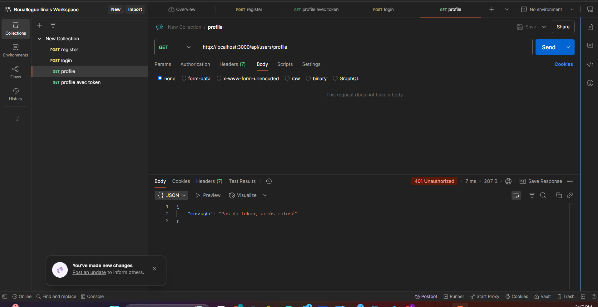

# 📚 TP MERN -- Authentification JWT (Partie 2 Backend)

## ✅ Objectif du TP

Le but de ce TP est de mettre en place un système d'authentification
sécurisé pour l'API EduPlatform à l'aide du standard JWT (JSON Web
Token).

Dans toute application moderne, certaines fonctionnalités doivent être
accessibles uniquement aux utilisateurs connectés (profil, inscription à
un cours, avis, etc.). Ce TP permet donc d'apprendre :

À gérer des utilisateurs (Register / Login).

À générer un token JWT pour identifier un utilisateur connecté.

À protéger des routes privées grâce à un middleware.

À connecter correctement le frontend (plus tard) au backend sécurisé.

👉 En résumé :

🎯 Le TP sert à apprendre comment sécuriser une API Node.js avec JWT.

------------------------------------------------------------------------

## 🔐 Principe de l'Authentification JWT

### 📌 Qu'est-ce qu'un JWT ?

Un JWT (JSON Web Token) est une clé numérique signée qui permet au
serveur d'identifier un utilisateur sans stocker de session en mémoire.

Un token JWT contient :

HEADER.PAYLOAD.SIGNATURE

  Partie      Rôle
  ----------- -----------------------------------------
  Header      Type du token et algorithme utilisé
  Payload     Informations utilisateur (id, email...)
  Signature   Vérification d'intégrité du token

------------------------------------------------------------------------

## 🔁 Cycle d'authentification JWT

1️⃣ L'utilisateur envoie email + mot de passe\
2️⃣ Le serveur vérifie les données\
3️⃣ Si valides → il génère un JWT\
4️⃣ Le token est renvoyé au client\
5️⃣ Le client envoie ce token dans chaque requête\
6️⃣ Le backend vérifie le token avec un middleware\
7️⃣ L'utilisateur est autorisé ou refusé

------------------------------------------------------------------------

## ⚙️ Notions MERN utilisées dans ce TP

### ✅ Node.js & Express

-   Création d'un serveur REST API
-   Routes: POST /register, POST /login, GET /profile
-   Middleware Express

### ✅ MongoDB & Mongoose

-   Création du modèle User
-   Stockage sécurisé des utilisateurs
-   Relations (courses: ObjectId\[\])

### ✅ Sécurité

-   bcryptjs : hachage des mots de passe
-   jsonwebtoken : création et vérification de JWT
-   dotenv : sécurisation des clés privées

### ✅ Middleware JWT

  Étape   Action
  ------- ------------------------------
  1       Lire le header Authorization
  2       Extraire le token
  3       Vérifier la signature JWT
  4       Décoder l'identité
  5       Attacher req.userId
  6       Autoriser ou bloquer

### ✅ Postman

-   Tester les routes API
-   Envoyer du JSON
-   Envoyer des headers de sécurité
-   Vérifier les retours du serveur

------------------------------------------------------------------------

## 🧰 Technologies

Node.js\
Express\
MongoDB + Mongoose\
bcryptjs\
jsonwebtoken\
dotenv\
morgan\
Postman

------------------------------------------------------------------------

## 📁 Arborescence du projet
```bash
 EDUPLATFORM/
│
├── config/
│   └── db.js                       ✅ Connexion MongoDB
│
├── controllers/
│   ├── courseController.js        ✅ logique cours
│   ├── profileController.js       ✅ logique profil
│   ├── reviewController.js        ✅ logique reviews
│   └── userController.js          ✅ logique users / auth
│
├── middleware/
│   ├── authMiddleware.js          ✅ vérifie JWT
│   └── errorMiddleware.js         ✅ gestion erreurs
│
├── models/
│   ├── Course.js
│   ├── Profile.js
│   ├── Review.js
│   └── User.js                    ✅ modèle avec password & relations
│
├── routes/
│   ├── authRoutes.js              ✅ routes /register + /login
│   ├── courseRoutes.js
│   └── userRoutes.js              ✅ routes utilisateurs + /profile (protégée)
│
├── .env                            ✅ config privée
├── server.js                      ✅ point d’entrée
├── package.json
└── README.md
```

------------------------------------------------------------------------

## ▶️ Lancer l'API

``` bash
npm install
node server.js
```

Messages attendus :

✅ MongoDB connected\
✅ Server running on port 5000

------------------------------------------------------------------------

## 🧪 Tests Postman

### 1️⃣ Register -- Inscription

POST\
http://localhost:3000/api/auth/register

``` json
{
  "username": "testuser",
  "email": "test@mail.com",
  "password": "123456"
}
```

📸 Capture :


------------------------------------------------------------------------

### 2️⃣ Login -- Connexion

POST\
http://localhost:3000/api/auth/login

``` json
{
  "email": "test@mail.com",
  "password": "123456"
}
```

📸 Capture :


------------------------------------------------------------------------

### 3️⃣ Récupération du Token

``` json
{
  "token": "eyJhbGciOiJIUzI1NiIsInR..."
}
```

------------------------------------------------------------------------

### 4️⃣ Accès à une route protégée

GET\
http://localhost:3000/api/users/profile

Header:

Authorization : Bearer VOTRE_TOKEN

📸 Captures :



------------------------------------------------------------------------

## 🛡️ Middleware JWT

Fonctions :

-   Vérifie la présence du token
-   Contrôle sa validité
-   Récupère l'utilisateur connecté
-   Autorise ou rejette la requête

------------------------------------------------------------------------

## ✅ Résultat final

✔ Register fonctionnel\
✔ Login sécurisé\
✔ JWT généré\
✔ Middleware opérationnel\
✔ Routes protégées accessibles uniquement avec token valide

------------------------------------------------------------------------

## 👩‍💻 Étudiante

Nom : Bouallegue Lina

------------------------------------------------------------------------

## 📝 Professeur

Signature : Abdelwaheb Gueddess


