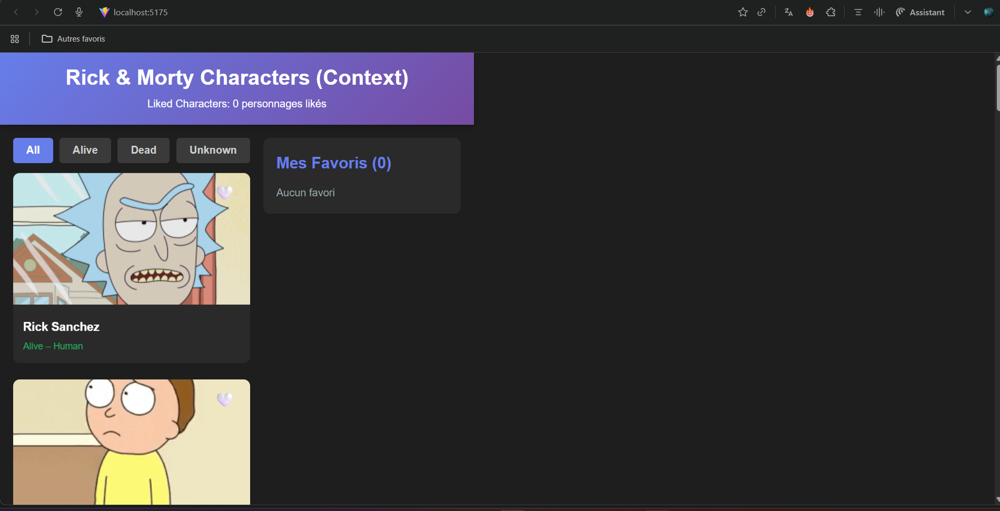

# 📘 TP React --- Galerie de Personnages Rick & Morty

**Version complète, détaillée, pédagogique --- avec toutes les étapes du
#TP (useContext)**

------------------------------------------------------------------------

# 🔥 1. Objectif du TP

Créer une application React complète affichant une galerie de
personnages **Rick & Morty**, incluant :

-   Chargement API (20 personnages)
-   Système **Like ❤️ / 🤍**
-   Gestion globale de l'état via **useContext**
-   Filtre par statut (All, Alive, Dead, Unknown)
-   Sidebar des favoris mise à jour en temps réel
-   Style complet avec `styles.css`

------------------------------------------------------------------------

# 🧱 2. Structure du projet

    src/
     ├── components/
     │    ├── Header.jsx
     │    ├── FilterBar.jsx
     │    ├── CharacterGrid.jsx
     │    ├── CharacterCard.jsx
     │    ├── FavoritesSidebar.jsx
     ├── context/
     │    └── CharactersContext.jsx
     ├── styles/
     │    └── styles.css
     ├── App.jsx
     └── main.jsx

------------------------------------------------------------------------

# 🚀 3. Étape 1 --- Création du projet

``` bash
npm create vite@latest react_s8 -- --template react
cd react_8
npm install
npm run dev
```

------------------------------------------------------------------------

# 🎨 4. Étape 2 --- Ajouter le fichier de styles

Créer :

    src/styles/styles.css

Ce fichier contient : - style global - header - cartes des personnages -
sidebar - bouton like - grille responsive

> **Tous les styles nécessaires sont fournis dans le TP.**

Importer le CSS dans `main.jsx` :

``` jsx
import "./styles/styles.css";
```

------------------------------------------------------------------------

# 🧠 5. Étape 3 --- Mise en place du useContext

Créer :

    src/context/CharactersContext.jsx

Ce fichier gère **TOUT l'état global** : - personnages - likes -
favoris - filtre - chargement - actions : toggleLike, setFilter -
données dérivées : getFilteredCharacters, getLikedCharacters

Ajouter :

``` jsx
<CharactersProvider>
  <App />
</CharactersProvider>
```

dans `main.jsx`.

------------------------------------------------------------------------

# 🛠 6. Étape 4 --- CharactersContext.jsx complet (logique globale)

Fonctionnalités :

### ✔ Chargement API dans useEffect

-   utilise `fetch("https://rickandmortyapi.com/api/character")`
-   stocke les personnages
-   active/désactive `loading`

### ✔ Gestion du Like

`toggleLike(id)`\
- ajoute ou enlève un personnage liké

### ✔ Filtrage

`setFilter("alive")` etc.

### ✔ Sélection des favoris

via `getLikedCharacters()`

### ✔ Sélection des personnages filtrés

via `getFilteredCharacters()`

Ce fichier agit comme **le cerveau de l'application**.

------------------------------------------------------------------------

# 🧩 7. Étape 5 --- Création des composants

------------------------------------------------------------------------

## ⭐ 7.1 Header.jsx

Affiche le titre + nombre de favoris.

Utilise :

``` jsx
const { likedIds } = useCharacters();
```

------------------------------------------------------------------------

## 🎛 7.2 FilterBar.jsx

Affiche les boutons :

    All | Alive | Dead | Unknown

L'utilisateur modifie le filtre via :

``` jsx
setFilter("alive");
```

------------------------------------------------------------------------

## 🧱 7.3 CharacterCard.jsx

Affiche :

-   image
-   nom
-   statut
-   espèce
-   cœur ❤️ / 🤍

Fonction clé :

``` jsx
onClick={() => toggleLike(character.id)}
```

------------------------------------------------------------------------

## 🖼 7.4 CharacterGrid.jsx

Affiche :

-   `Chargement...` si loading
-   sinon tous les personnages filtrés

Utilise :

``` jsx
getFilteredCharacters();
```

------------------------------------------------------------------------

## ⭐ 7.5 FavoritesSidebar.jsx

Affiche la liste des personnages likés en temps réel.

Utilise :

``` jsx
getLikedCharacters();
```

------------------------------------------------------------------------

# 🧱 8. Étape 6 --- Construction de App.jsx

`App.jsx` organise toute l'interface :

    Header
      FilterBar
        CharacterGrid
        FavoritesSidebar

Structure finale :

``` jsx
<div className="main-container">
  <div>
    <FilterBar />
    <CharacterGrid />
  </div>

  <FavoritesSidebar />
</div>
```

------------------------------------------------------------------------

# 🎨 9. Étape 7 --- Correction du bouton Like

Le cœur doit changer ainsi :

-   🤍 (non liké)
-   ❤️ (liké)

Sans fond rouge :

``` jsx
{isLiked ? "❤️" : "🤍"}
```

CSS corrigé :

``` css
.like-btn {
  background: transparent;
  display: flex;
  align-items: center;
  justify-content: center;
}
```

------------------------------------------------------------------------

# 📺 10. Étape 8 --- Pleine largeur de l'écran

Modifier :

``` css
.main-container {
    display: grid;
    grid-template-columns: 1fr 300px;
    width: 100%;
    max-width: none;
    margin: 0;
}
```

👉 Cette image illustre l'état de l'application lorsqu'un utilisateur a
**déjà liké plusieurs personnages**.
Pour que l'affichage prenne **tout l'écran**.

------------------------------------------------------------------------

# 🧪 11. Lancement final

``` bash
npm run dev
```

Vous obtenez :

### ✔ Galerie des personnages

### ✔ Likes fonctionnels

### ✔ Sidebar favoris dynamique

### ✔ State global 100% géré par useContext

### ✔ UI moderne, responsive et cohérente avec le TP
## 📌 Aucun favori sélectionné


Cette capture montre : - Le compteur des likes indiquant **0 personnages
likés**. - La sidebar affiche "Aucun favori". - Les cœurs sur les cartes
sont **blancs 🤍**, puisque rien n'est liké. - Le filtre est sur "All".

👉 Cette image montre le **comportement de l'application juste au
lancement**, avant que l'utilisateur ne commence à liker.

------------------------------------------------------------------------

## 📌  Affichage de sélection des favoris


------------------------------------------------------------------------


## 📌 Image 3 --- Application étendue avec scroll


Cette capture montre : - Plusieurs personnages likés dans la sidebar (4
favoris). - Un affichage plus grand, révélant plusieurs cartes dans la
grille. - Les cœurs rouges toujours visibles en haut des cartes
likées. - Le reste de l'écran vide à droite --- provenant ici d'un
zoom/échelle système ou style en cours de correction.

👉 Cette image illustre la **grille complète avec plusieurs cartes** et
la sidebar épinglée à droite.

------------------------------------------------------------------------


