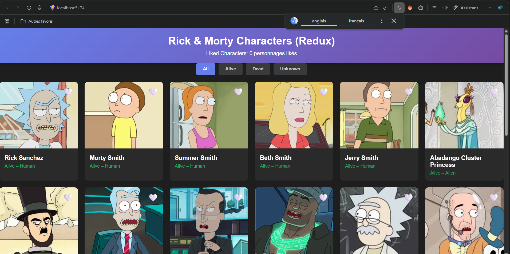
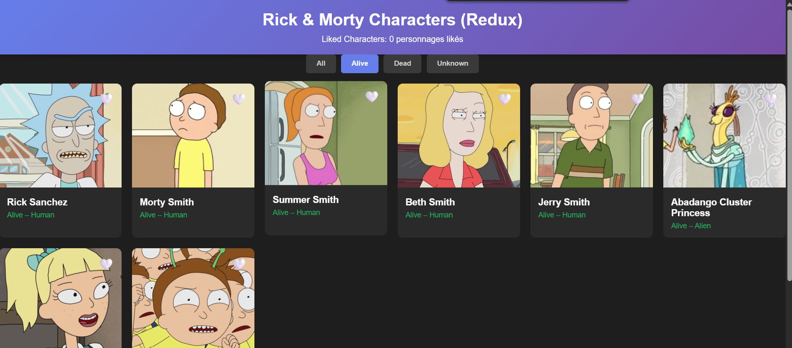
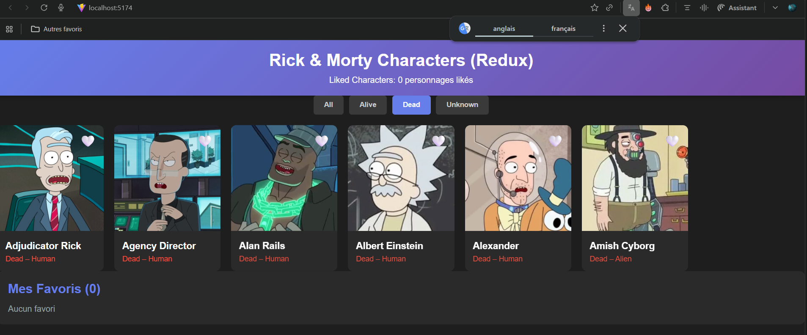
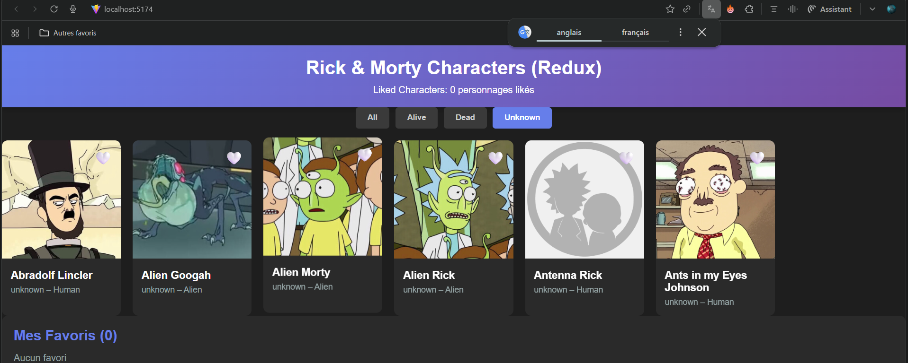
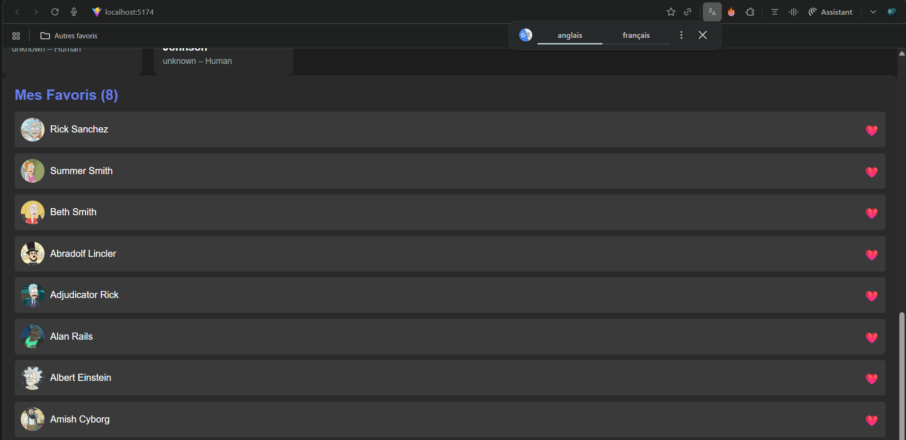

# 📘 TP React --- Galerie de Personnages Rick & Morty

**Version complète, détaillée, pédagogique --- avec toutes les étapes du
#TP (Redux)**

------------------------------------------------------------------------

## 🔥 1. Objectif du TP
Créer une application React complète affichant une galerie de personnages Rick & Morty, incluant :
- Chargement API
- Like ❤️ / 🤍
- Filtre Alive / Dead / Unknown
- Sidebar favoris
- Gestion d’état via **Redux Toolkit**
- Architecture professionnelle

---

## 🧱 2. Structure du projet

src/
 ├── components/
 │    ├── Header.jsx
 │    ├── FilterBar.jsx
 │    ├── CharacterGrid.jsx
 │    ├── CharacterCard.jsx
 │    ├── FavoritesSidebar.jsx
 ├── store/
 │    ├── store.js
 │    ├── moviesSlice.js
 │    └── selectors.js
 ├── styles/
 │    └── styles.css
 ├── App.jsx
 └── main.jsx

---

## 🚀 3. Installation

```bash
npm i @reduxjs/toolkit react-redux
```

---

## 🧠 4. Le store Redux

store/store.js :
```js
import { configureStore } from "@reduxjs/toolkit";
import moviesReducer from "./moviesSlice";

export const store = configureStore({
  reducer: { movies: moviesReducer },
});
```

---

## 🛠 5. Slice principal : moviesSlice.js

Gère :
- personnages (characters)
- favoris (favoritesIds)
- filtre (filterStatus)
- chargement + erreurs
- actions Redux
- thunk API

Code :
```js
import { createAsyncThunk, createSlice } from "@reduxjs/toolkit";

export const fetchCharacters = createAsyncThunk(
  "movies/fetchCharacters",
  async () => {
    const res = await fetch("https://rickandmortyapi.com/api/character");
    const data = await res.json();
    return data.results;
  }
);

const moviesSlice = createSlice({
  name: "movies",
  initialState: {
    characters: [],
    favoritesIds: [],
    filterStatus: "all",
    loading: false,
    error: null,
  },
  reducers: {
    toggleFavorite(state, action) {
      const id = action.payload;
      if (state.favoritesIds.includes(id))
        state.favoritesIds = state.favoritesIds.filter((x) => x !== id);
      else state.favoritesIds.push(id);
    },
    setFilterStatus(state, action) {
      state.filterStatus = action.payload;
    },
  },
  extraReducers: (builder) => {
    builder
      .addCase(fetchCharacters.pending, (state) => {
        state.loading = true;
      })
      .addCase(fetchCharacters.fulfilled, (state, action) => {
        state.loading = false;
        state.characters = action.payload;
      })
      .addCase(fetchCharacters.rejected, (state, action) => {
        state.loading = false;
        state.error = action.error.message;
      });
  },
});

export const { toggleFavorite, setFilterStatus } = moviesSlice.actions;
export default moviesSlice.reducer;
```

---

## 🎯 6. Selectors Redux

selectors.js :
```js
export const selectState = (state) => state.movies;

export const selectFilteredCharacters = (state) => {
  const { characters, filterStatus } = selectState(state);
  if (filterStatus === "all") return characters;
  return characters.filter(
    (c) => c.status.toLowerCase() === filterStatus
  );
};

export const selectFavoriteCharacters = (state) => {
  const { characters, favoritesIds } = selectState(state);
  return characters.filter((c) => favoritesIds.includes(c.id));
};
```

---

## 🔌 7. Connexion Redux dans main.jsx

```jsx
<Provider store={store}>
  <App />
</Provider>
```

---

## 🧩 8. Composants Redux (UI pure)

### CharacterCard.jsx
```jsx
function CharacterCard({ character, isLiked, onToggleLike }) {
  return (
    <div className="character-card">
      <button
        className={`like-btn ${isLiked ? "liked" : ""}`}
        onClick={() => onToggleLike(character.id)}
      >
        {isLiked ? "❤️" : "🤍"}
      </button>
      
      <div className="character-info">
        <div className="character-name">{character.name}</div>
        <div className={`character-status status-${character.status.toLowerCase()}`}>
          {character.status} – {character.species}
        </div>
      </div>
    </div>
  );
}
```

### CharacterGrid.jsx
```jsx
function CharacterGrid({ characters, likedIds, onToggleLike, loading }) {
  if (loading) return <div className="loading">Chargement...</div>;
  return (
    <div className="character-grid">
      {characters.map((c) => (
        <CharacterCard
          key={c.id}
          character={c}
          isLiked={likedIds.includes(c.id)}
          onToggleLike={onToggleLike}
        />
      ))}
    </div>
  );
}
```

### FilterBar.jsx
```jsx
function FilterBar({ filter, onFilterChange }) {
  const filters = ["all", "alive", "dead", "unknown"];
  return (
    <div className="filter-bar">
      {filters.map((f) => (
        <button
          key={f}
          className={`filter-btn ${filter === f ? "active" : ""}`}
          onClick={() => onFilterChange(f)}
        >
          {f}
        </button>
      ))}
    </div>
  );
}
```

### FavoritesSidebar.jsx
```jsx
function FavoritesSidebar({ favorites, onToggleLike }) {
  return (
    <div className="favorites-sidebar">
      <h2>Mes Favoris ({favorites.length})</h2>
      {favorites.length === 0 ? (
        <p>Aucun favori</p>
      ) : (
        favorites.map((c) => (
          <div key={c.id} className="favorite-item">
            
            <span>{c.name}</span>
            <button onClick={() => onToggleLike(c.id)}>❤️</button>
          </div>
        ))
      )}
    </div>
  );
}
```

### Header.jsx
```jsx
function Header({ likedCount }) {
  return (
    <header className="header">
      <h1>Rick & Morty Characters (Redux)</h1>
      <div className="liked-badge">
        Liked Characters: {likedCount}
      </div>
    </header>
  );
}
```

---

## 🧩 9. App.jsx (Orchestrateur Redux)

```jsx
export default function App() {
  const dispatch = useDispatch();
  const { favoritesIds, filterStatus, loading, error } =
    useSelector(selectState);

  const filteredCharacters = useSelector(selectFilteredCharacters);
  const favoriteCharacters = useSelector(selectFavoriteCharacters);

  useEffect(() => {
    dispatch(fetchCharacters());
  }, [dispatch]);

  return (
    <div className="container">
      <Header likedCount={favoritesIds.length} />

      <FilterBar
        filter={filterStatus}
        onFilterChange={(f) => dispatch(setFilterStatus(f))}
      />

      {loading && <p>Chargement...</p>}
      {error && <p>{error}</p>}

      <div className="layout">
        <CharacterGrid
          characters={filteredCharacters}
          likedIds={favoritesIds}
          loading={loading}
          onToggleLike={(id) => dispatch(toggleFavorite(id))}
        />

        <FavoritesSidebar
          favorites={favoriteCharacters}
          onToggleLike={(id) => dispatch(toggleFavorite(id))}
        />
      </div>
    </div>
  );
}
```

---

## 📸 10. Zones pour captures d’écran

### 📌 Capture 1 — Accueil (20 personnages)


### 📌 Capture 2 — Alive


### 📌 Capture 3 — Dead


### 📌 Capture 4 — Uncknowen


### 📌 Capture 5 — Favoris ❤️



---

## 🧠 11. Résultat final

✔ App complète en Redux  
✔ Performante et scalable  
✔ UI identique à useContext  
✔ Logique centralisée  
✔ Architecture professionnelle  

---


