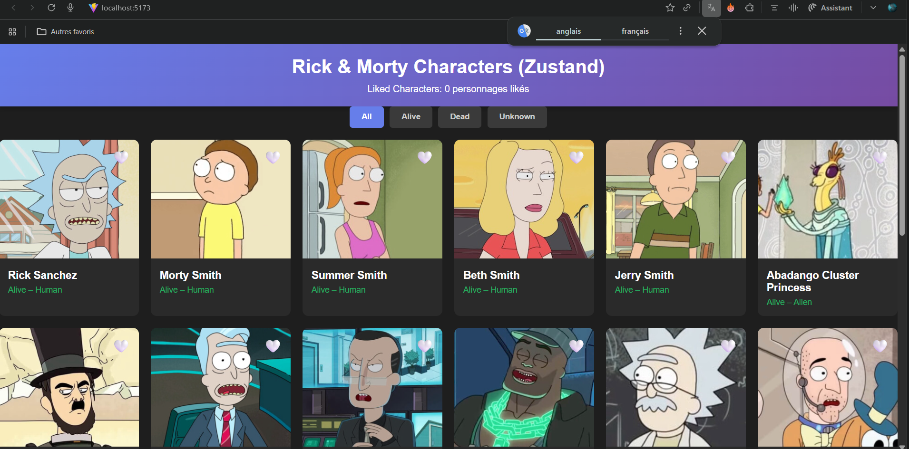

# 📘 TP React — Galerie de Personnages Rick & Morty (Zustand)

## 🔥 1. Objectif du TP
Créer une application React complète affichant une galerie de personnages Rick & Morty, incluant :
- Chargement API
- Like ❤️ / 🤍
- Filtre Alive / Dead / Unknown
- Sidebar favoris
- Gestion d’état avec **Zustand**
- UI identique aux versions Context & Redux

---

## 🧱 2. Structure du projet

src/
 ├── components/
 │    ├── Header.jsx
 │    ├── FilterBar.jsx
 │    ├── CharacterGrid.jsx
 │    ├── CharacterCard.jsx
 │    ├── FavoritesSidebar.jsx
 ├── store/
 │    └── useCharactersStore.js
 ├── styles/
 │    └── styles.css
 ├── App.jsx
 └── main.jsx

---

## 🚀 3. Installation

```bash
npm i zustand
```

---

## 🧠 4. Le store Zustand

Zustand combine :
✔ le state  
✔ les actions  
✔ les sélecteurs  
dans **un seul fichier**.

store/useCharactersStore.js :

```js
import { create } from "zustand";

export const useCharactersStore = create((set, get) => ({
  characters: [],
  favoritesIds: [],
  filterStatus: "all",
  loading: false,
  error: null,

  fetchCharacters: async () => {
    set({ loading: true });
    try {
      const res = await fetch("https://rickandmortyapi.com/api/character");
      const data = await res.json();
      set({ characters: data.results, loading: false });
    } catch (e) {
      set({ error: e.message, loading: false });
    }
  },

  toggleFavorite: (id) => {
    const favs = get().favoritesIds;
    set({
      favoritesIds: favs.includes(id)
        ? favs.filter((x) => x !== id)
        : [...favs, id],
    });
  },

  setFilterStatus: (status) => set({ filterStatus: status }),

  getFilteredCharacters: () => {
    const { characters, filterStatus } = get();
    if (filterStatus === "all") return characters;
    return characters.filter(
      (c) => c.status.toLowerCase() === filterStatus
    );
  },

  getFavoriteCharacters: () => {
    const { characters, favoritesIds } = get();
    return characters.filter((c) => favoritesIds.includes(c.id));
  },
}));
```

---

## 🔌 5. main.jsx

Aucun Provider nécessaire :

```jsx
import React from "react";
import ReactDOM from "react-dom/client";
import App from "./App";
import "./styles/styles.css";

ReactDOM.createRoot(document.getElementById("root")).render(
  <React.StrictMode>
    <App />
  </React.StrictMode>
);
```

---

## 🧩 6. App.jsx (orchestrateur Zustand)

```jsx
import { useEffect } from "react";
import { useCharactersStore } from "./store/useCharactersStore";

import Header from "./components/Header";
import FilterBar from "./components/FilterBar";
import CharacterGrid from "./components/CharacterGrid";
import FavoritesSidebar from "./components/FavoritesSidebar";

export default function App() {
  const {
    fetchCharacters,
    toggleFavorite,
    setFilterStatus,
    favoritesIds,
    filterStatus,
    loading,
    error,
    getFilteredCharacters,
    getFavoriteCharacters,
  } = useCharactersStore();

  useEffect(() => {
    fetchCharacters();
  }, [fetchCharacters]);

  const filteredCharacters = getFilteredCharacters();
  const favoriteCharacters = getFavoriteCharacters();

  return (
    <div className="container">
      <Header likedCount={favoritesIds.length} />

      <FilterBar
        filter={filterStatus}
        onFilterChange={setFilterStatus}
      />

      {loading && <p>Chargement...</p>}
      {error && <p>{error}</p>}

      <div className="layout">
        <CharacterGrid
          characters={filteredCharacters}
          likedIds={favoritesIds}
          loading={loading}
          onToggleLike={toggleFavorite}
        />

        <FavoritesSidebar
          favorites={favoriteCharacters}
          onToggleLike={toggleFavorite}
        />
      </div>
    </div>
  );
}
```

---

## 🎭 7. Composants UI

Ils sont identiques à la version Redux (props only).

### CharacterCard.jsx
```jsx
function CharacterCard({ character, isLiked, onToggleLike }) {
  return (
    <div className="character-card">
      <button
        className={`like-btn ${isLiked ? "liked" : ""}`}
        onClick={() => onToggleLike(character.id)}
      >
        {isLiked ? "❤️" : "🤍"}
      </button>
      
      <div className="character-info">
        <div className="character-name">{character.name}</div>
        <div className={`character-status status-${character.status.toLowerCase()}`}>
          {character.status} – {character.species}
        </div>
      </div>
    </div>
  );
}
```

---

## 📸 8.Capture 



---

## 🧠 9. Zustand comparé aux autres

| Système | Difficulté | Performance | Code | Usage idéal |
|--------|-------------|-------------|-------|--------------|
| Context | ⭐⭐ | ⭐⭐ | simple | petit projet |
| Redux Toolkit | ⭐⭐⭐⭐ | ⭐⭐⭐⭐ | structuré | grands projets |
| Zustand | ⭐ | ⭐⭐⭐ | ultra léger | petites & moyennes apps |

---

## ✔ 10. Conclusion

La version Zustand :
- est la plus simple
- ne nécessite aucun Provider
- offre un store global clair dans un seul fichier
- garde une UI identique aux autres versions
- est parfaite pour les projets modernes

---

Auteur : Abdelwaheb Gueddess
Etudiante: Lina Bouallègue
